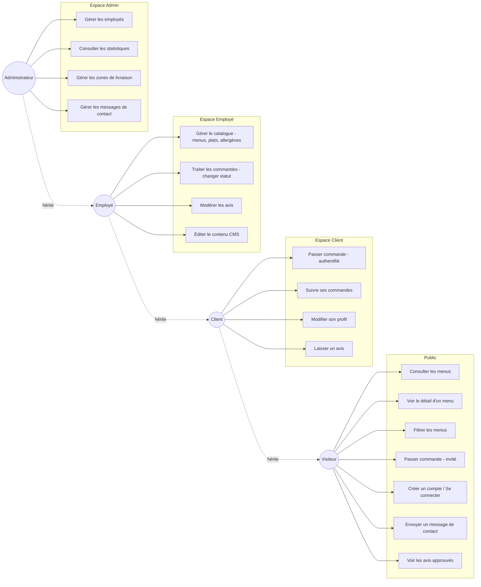
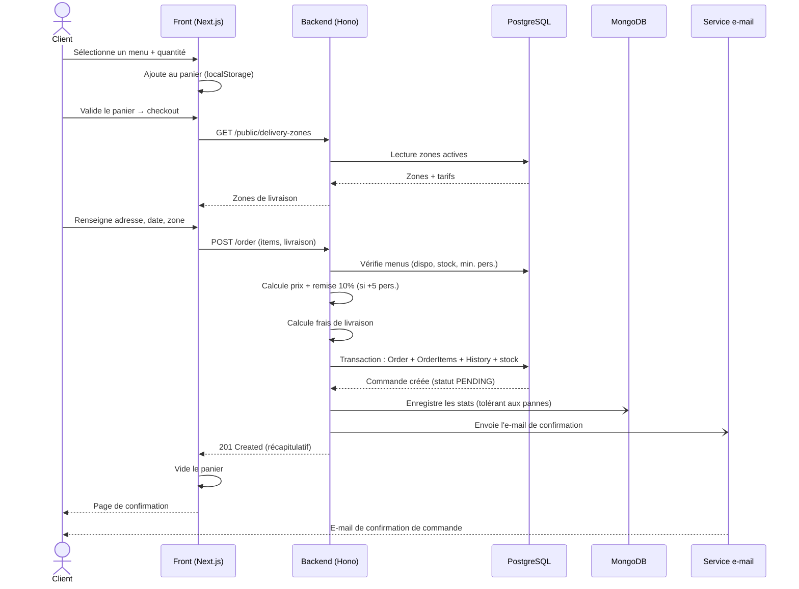
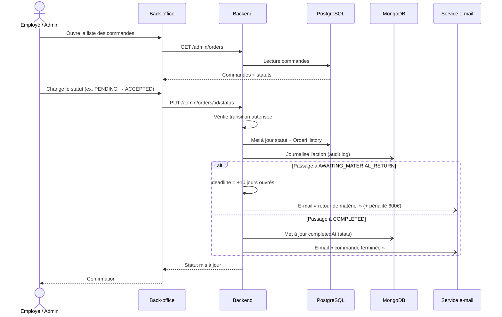
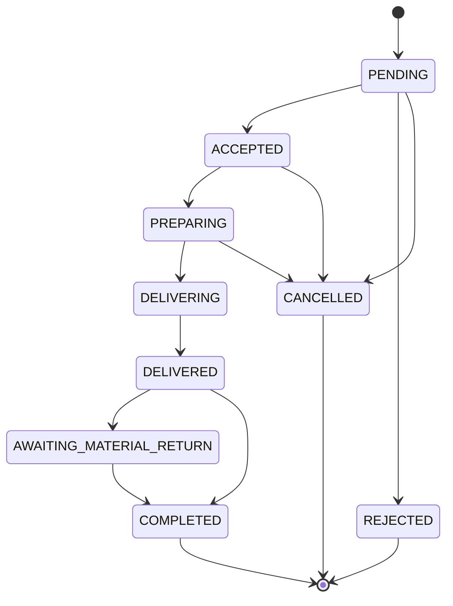

# Diagrammes — Vite & Gourmand

## 1. Diagramme de cas d'utilisation

Quatre acteurs, avec héritage des droits (Client hérite du Visiteur, Employé du Client,
Administrateur de l'Employé).

## 2. Diagramme de séquence — Passer une commande

Parcours de commande d'un client (authentifié ou invité), de la sélection au mail
de confirmation.

## 3. Diagramme de séquence — Cycle de vie du statut d'une commande

Traitement d'une commande par le personnel, avec les e-mails déclenchés.

## Statuts de commande (machine à états)

