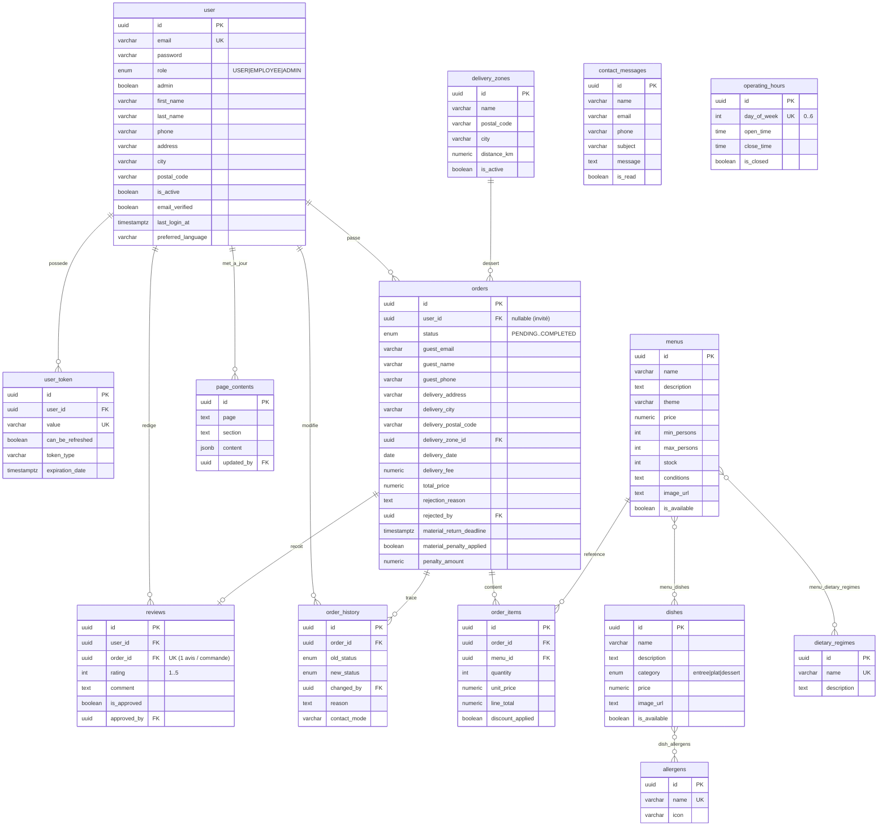

# Modèle Conceptuel de Données — Vite & Gourmand

L'application repose sur **deux bases** :

- **PostgreSQL** (relationnel) : cœur métier — catalogue, commandes, utilisateurs, CMS.
- **MongoDB** (non relationnel) : vues dérivées — statistiques de commandes et journal d'audit.

Le modèle ci-dessous reflète le schéma réel (18 tables, cf. `docs/database/schema.sql`).
Il étend le MCD de référence du sujet (annexe 1) : 3 rôles utilisateur, commandes
multi-menus via `order_items`, statuts de commande étendus, `distance_km` sur les zones,
et collections MongoDB.

## Diagramme entité-relation (PostgreSQL)

## Tables d'association (relations N-N)

| Table de jointure       | Relie                          |
| ----------------------- | ------------------------------ |
| `menu_dishes`           | `menus` ↔ `dishes`             |
| `menu_dietary_regimes`  | `menus` ↔ `dietary_regimes`    |
| `dish_allergens`        | `dishes` ↔ `allergens`         |

## Collections MongoDB (base non relationnelle)

| Collection    | Rôle                                                                 |
| ------------- | ------------------------------------------------------------------- |
| `order_stats` | Statistiques par menu (nombre de commandes, CA) — alimente le tableau de bord admin. |
| `audit_logs`  | Journal d'audit des actions du personnel (changements de statut, modération…). |

> Les collections MongoDB sont des **vues dérivées** tolérantes aux pannes : leur
> indisponibilité n'empêche pas le fonctionnement de l'API.
